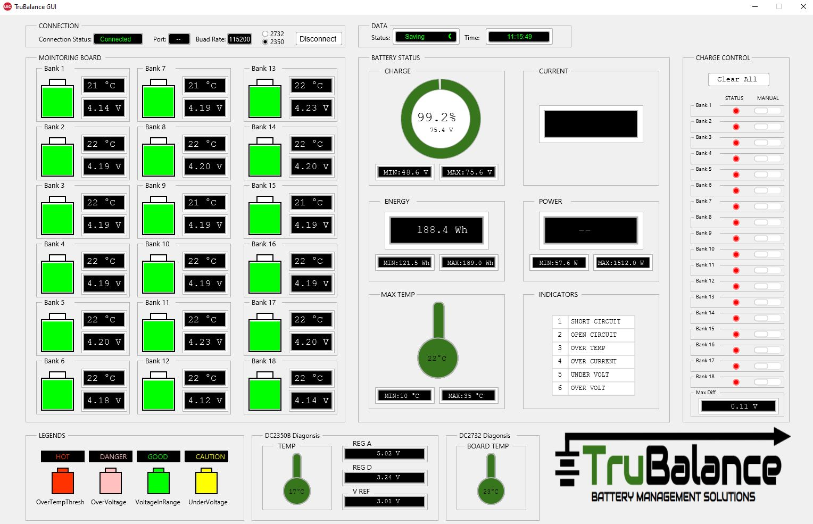

# TruBalance BMS

This repository contains the Arduino and GUI codes used in the **TruBalance BMS**.

# Arduino

  

The user of this system must confirm the hardware connections before uploading any code to the Linduino board. This could be done with the schematic design provided above, pictures of the current colored wires (utilized by the TruBalance Team) are also provided. 
  

 - **Arduino Setup:**
   
      - [Download and install the Arduino IDE (Recommended Version 1.8 or Later).](https://www.arduino.cc/en/software) 
      - [Download the Arduino Libraries from the folder above.](https://github.com/MohamadMerei1/TruBalance/tree/main/Arduino_Libraries)
      - Unzip the LinduinoSketch folder.
      - Locate the Arduino libraries folder:`C:\Users\moham\Documents\Arduino\`
      - Place the downloaded libraries inside the Arduino folder from the path above, where  
        the folder will look like the following:
        

        
        

      - Place the `ltcmuc_tools` and `ltcmuc_tools_ext` folders from: `~\Arduino\LinduinoSketchbook2949\libraries\`, in:  
      `~\Arduino\LTSketchbook\libraries`
      - Start the Arduino IDE
      - Go into Preferences under File
      - Change the sketch location to: `C:\Users\moham\Documents\Arduino\LTSketchbook`, adjust this based on the location on your PC. 
        

        
        

      - Other libraries may be required to be installed, you can always do so by locating the Library Manager Button under tools and searching for the needed library (This is unlikely).
      - Once all libraries are installed, Restart the Arduino IDE
      - Locate Board button under Tools and choose Arduino UNO
      - Make sure your USB is connected to a Linduino 
      - Choose the correct port under Tools
      - Download the sketch from Arduino Code folder above and Upload it to the Linduino Board 
      - If no errors appear in the console window, this would mean the linduino board was programmed successfully
      - Some steps to Troubleshooting errors:  
      
            1. Restart Arduino IDE
            2. Make sure libraries are located as explained above
            3. Your OS may not have the correct USB driver, search online for the correct one
            4. Try a difference OS
        
If these steps were followed carefully the linduino board should now contain the program needed for running the system. The user should be able to see the data being scanned by the serial monitor. The data is received as specified by the read sequence shown below: 
        

        
        

# Processing

The user must confirm that the data being scanned by the serial monitor matches the read sequence above before running the processing GUI code.
  

 - **Processing Setup:**
   
      - [Download Processing (Recommended Version 4.0 or later).](https://processing.org/download) 
      - Download the following libraries in Processing from: `Sketch > Import Library > Add Library` 
  
                1. javafx 
                2. Serial  
                3. Sound  
                4. controlP5
  
      - Download the Processing GUI folder above
      - Run Processing
      - Inside the GUI screen, press connect to start the continuous loop of the system
  
Now, you should be able to see the values and functionalities of the system in the GUI screen. Below is an example of a fully functional TruBalance GUI:
        

        
        

 - **GUI features:**  
  
                1. The GUI provides continuous measurements of the TruBalance BMS including: bank voltages, temperatures, state of charge, current, power , energy boards diagnosis values, and Fault codes.   
                2. The GUI also provides manual control of the discharge function of the TruBalance system, this feature allows triggering discharge of any bank in the battery pack, clearing discharge will clear all discharge registers of the system. 
                
  
 - **Troubleshooting errors and GUI freezing issues:**
  
                1. Restart processing  
                2. Make sure that the serial monitor of Arduino is not open (This will cause conflict on the serial port and the GUI will freeze)  
                3. Confirm that the code matches the amount of data being sent from arduino (Adjust the code accordingly, this is unlikely with the codes provided in this GitHub)
  
  
 
 
# Credit

The arduino code and libraries utilized in this project are based on a modified version
of the sketches provided by **Analog Devices**. 

  

