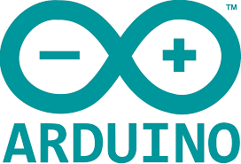

# TruBalance BMS

This repository contains the Arduino and GUI codes used in the TurBalance BMS.

# Arduino

  - Arduino Setup:
   
      - [Download and install the Arduino IDE (Recommended Version 1.8 or Later).](https://www.arduino.cc/en/software) 
      - [Download the Arduino Libraries from the folder above.](https://github.com/MohamadMerei1/TruBalance/tree/main/Arduino_Libraries)
      - Unzip the LinduinoSketch folder.
      - Locate the Arduino libraries folder:
      `C:\Users\moham\Documents\Arduino\`
      - Place the downloaded libraries inside the Arduino folder from the path above, the folder will look like the following:

      - Place the folders from: 
      `~\Arduino\LinduinoSketchbook2949\libraries\`.

# Processing

# Credit

The arduino code and libraries utilized in this project are based on a modified version
of the sketches provided by Analog Devcies. 

  

